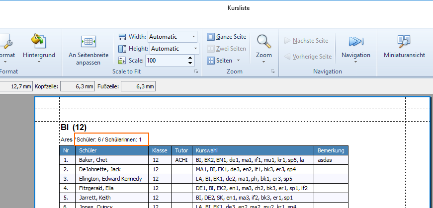

# Voraussichtliche Änderungen

!!! info "Hinweis"

    Sie erhalten hier einen Überblick über die voraussichtlichen Änderungen und Korrekturen für das nächste Serviceupdate.

## LEGENDE

| Abkürzung | Bedeutung |
| --- | --- |
| FIX | Korrektur bestehender Funktionalität |
| NEW | Neue Funktionalität |
| CHANGE | Änderung des Ablaufs, Verarbeitung oder Bedienung |

## DAVINCI WEBBOX Version 1.10.5 \[unveröffentlicht\]

[**UPDATE-ANLEITUNG**](https://doc.davinci6.stueber.de/09.infoserver/update-internet-publication/infoserver-und-webbox-aktualisieren/)

!!! warning "Wichtig"

    Bitte beachten Sie unsere Dokumentation hinsichtlich des Umgangs mit Veröffentlichungen in DAVINCI LOOK und der DAVINCI WEBBOX: [Welche Vertretungsinformationen werden für LOOK oder die WEBBOX publiziert?](https://doc.davinci6.stueber.de/substitution-plan/veroeffentlichung/veroeffentlichung/)

## DAVINCI Version 6.5.61

### SERVER

### INFOSERVER

### STUNDENPLAN

* FIX: Kernzeiten werden nicht mehr wie Sperrzeiten interpretiert
* NEW: Auswahlfenster - Shortcut `Strg + F`für Auswahlfenster Fächer
* FIX: `Plan-Eigenschaften > Planeinträge > Farben` Streifen mit Farbverlauf
* FIX: `Plan-Eigenschaften > Stundenplan` aktivierte Einstellung der Anzeige `Immer Uhrzeiten anzeigen` klappt wieder
* FIX: Stundenplan-Zeitkonto  Operator `A` - Berechnung klappt wieder korrekt für die Fächer, die in der Ansicht `Stammdaten > Fächer` in der Spalte „Zeitkonto“ für ein Fach einen Lehrer-Soll-Schlüssel mit dem Operator `A` als Zeitkonto zugewiesen bekommen haben.
  
### VERTRETUNGSPLAN

* FIX: frei gewordener Raum (z.B. durch Klassenfehlzeit) wird als freier Raum zur Vertretungserstellung angeboten
* FIX: Lehrer übernimmt Vertretung und wird dann selbst krank
* FIX: Lehrer übernimmt Vertretung und wird dann selbst krank, Termine tauchen wieder zur Vertretung in der Liste der offenen Vertretungen auf
* NEW: Bereich `Änderungsliste` > In der Änderungsliste sind die Zellen "Datum" und "Tag" aktuell vertikal miteinander verbunden. Neuer Rechte-Maustaste Befehl in der Änderungsliste `Datumzellen zusammenfassen`. Wenn dies markiert ist, werden die Datumszellen zusammengefasst, sonst nicht.
  

  
### KURSPLAN

* FIX: `Kursplan > Fachwahlen` Alle Fachwahlen markieren
* FIX: fälschlichwerweise angezeigt Konflikt werden über `Extras > Plandatei aufräumen` gelöscht
* FIX: `Kursplan > Fachwahlen` > alle Fachwahlen markieren wieder möglich

### LOOK

* FIX: ein über DAVINCI LOOK gebuchte Ressourcen wird in der Ansicht der Ressource gezeigt
  
### DRUCK

* FIX: Ausdruck > Kursliste - Designänderungen werden  übernommen
* NEW: Druckformat "Kurslisten" > Erweiterung der Ausgabe um Schülergeschlecht, Summen werden nun stets in der Überschrift angegeben
* NEW: Druckformat "Kurslisten" > Erweiterung der Ausgabe um Schülergeschlecht
  
### HTML Export

### Sonstiges

* FIX: Übersicht "Ausfallstatistik" > Bitte einmalig über `Extras > Plandatei aufräumen` ausführen, damit werden fehlerhafte Änderungselemente gelöscht.