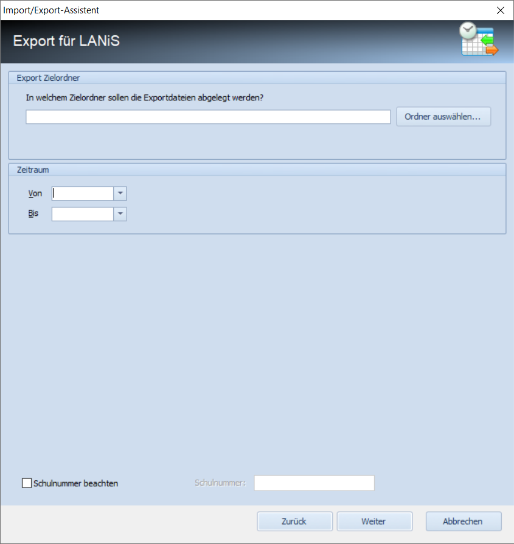

# LANiS Export

In DAVINCI ist ein manueller Upload der Vertretungsdaten nach LANiS integriert. LANiS ist ein Service, der von der _Hessischen Lehrkräfteakademie_ den Schulen zur Verfügung gestellt wird.

## So gehen Sie in DAVINCI vor

1. Wählen Sie über `Plan > Importieren und Exportieren > Exportieren > Export nach LANiS` aus und klicken Sie auf `Weiter`.

2. Geben Sie nun über das Eingabefeld `Export Zielordner` den Zielordner an, in dem die LANIS Datei gespeichert werden soll. Klicken Sie auf `Weiter`, um den Export zu starten.

3. Geben Sie beim Zeitraum bitte den zu exportierenden Zeitraum für die Vertretungsdaten an.

4. Das Ergebnis ist eine Datei mit dem Namen vertretungsplan.csv.

5. Diese Datei enthält folgende Informationen:

Spalte | Inhalt
-|-
Tag| Datum der Fehlzeit bzw. Vertretungsinfomration
Lehrer| Originallehrer
Stunde|Stunde laut Zeitrahmen
Klasse| betroffene Klasse
Art | Art der Änderung (Änderung, Aufsicht, Klasse fehlt)
Vertreter| Vertretungslehrer
Fach|Vertretunsfach
Raum| Vertretungraum
Hinweis Raum_alt| Originalraum
Fach_alt |Originalfach
Klasse_alt| betroffene Klasse
Hinweis2|
Lerngruppe|
